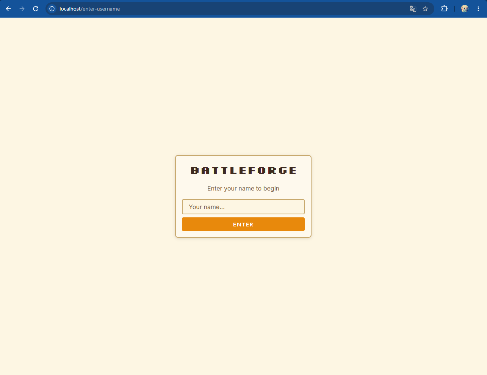
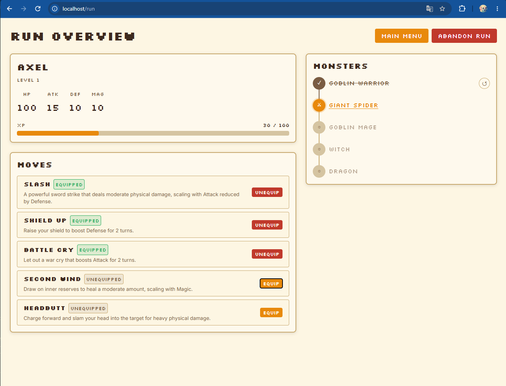
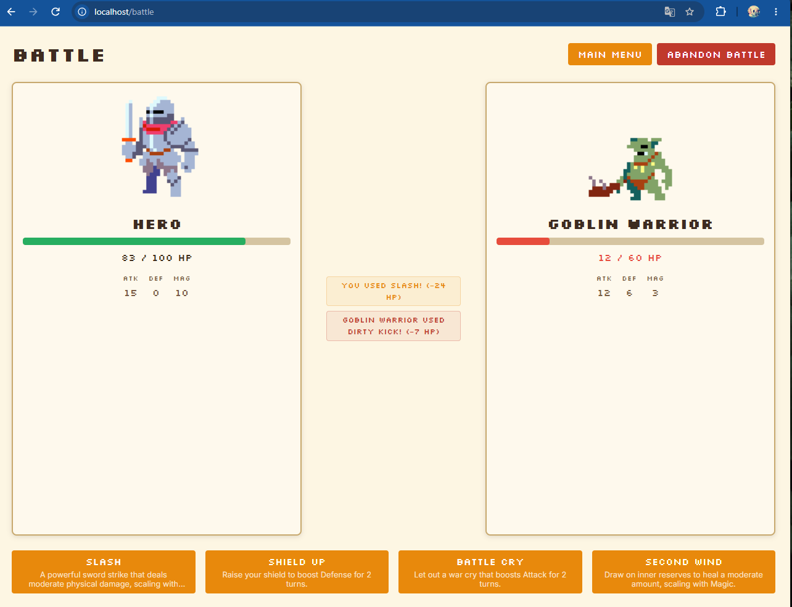

# ⚔️ BattleForge — Game Platform

A turn-based RPG built as a complete production software lifecycle exercise. The game is real and playable, but the point of the project is everything around it — containerization, orchestration, cloud deployment and automated delivery, each layer added on top of a working system.

---

## Roadmap

| Layer | Stack | Status |
|---|---|---|
| Application | Spring Boot, Angular, PostgreSQL | ✅ |
| Containerization | Docker, docker-compose, nginx | ✅ |
| Orchestration | Kubernetes (Minikube) | ✅ |
| Cloud | Google Kubernetes Engine | ✅ |
| CI/CD | GitHub Actions, GHCR | ✅ |
| Infrastructure as Code | Terraform | in progress |
| Observability | Prometheus, Grafana, Micrometer | planned |
| Game Analytics | win rates, difficulty curves, XP progression | planned |
| Load Simulation | traffic generation, autoscaling | planned |

---

## Features

* **Gauntlet Run** — The hero fights through five monsters in order; beat them all to win the run
* **Turn-Based Combat** — Hero and monster alternate turns until one side reaches zero HP
* **Move System** — Physical and magic moves with damage, healing, buffs and debuffs
* **Progression** — Battles award XP; leveling up increases Attack, Defense, Health and Magic
* **Move Learning** — Defeating a monster teaches the hero one of its moves, equippable between battles

---

## How to Run

The application is started using Docker Compose. Images are pulled prebuilt from **GHCR**, so no JDK, Node or PostgreSQL is required locally — only Docker.

**1. Clone the repository**

```bash
git clone https://github.com/1Aksel1/BattleForge.git
cd BattleForge
```

**2. Create a `.env` file** in the project root, using `.env.example` as a starting point:

```dotenv
DB_USER=postgres
DB_PASSWORD=123123123
DB_NAME=battleforge
JPA_DDL_AUTO=create-drop
JPA_SHOW_SQL=true
```

`create-drop` resets the schema on every restart, which is convenient for local testing. The deployed environment uses `update` to preserve data across restarts.

**3. Terminal:** Start the web application

```bash
docker-compose up
```

### Access the application

**Frontend:** http://localhost:80

No signup is required. Enter a name on the first screen and the run begins.

---

## The Game

Enter a name to start a session.



The run overview shows the hero's stats, XP progress, the move pool, and the five monsters in the gauntlet. Moves can be equipped and swapped between battles.



In battle, the player picks a move and the server resolves both sides of the turn — damage, healing, buffs and status effects — then returns the updated state.



---

## Infrastructure

### Containerization

Both services use multi-stage **Dockerfiles** — a build stage that compiles the application and a slim runtime stage carrying only the artifact. The frontend is served by **nginx**, which also reverse proxies API calls to the backend.

### Kubernetes

The `k8s/` directory contains hand-written manifests:

* **StatefulSet** for PostgreSQL with a persistent volume claim
* **Deployments** and **Services** for backend and frontend
* **Secret** for database credentials
* **ConfigMap** for non-sensitive application configuration

Tested locally on **Minikube**, including replica scaling and rolling updates.

### Cloud

Deployed to **Google Kubernetes Engine**, exposed to the internet through an external load balancer.

### CI/CD

A **GitHub Actions** pipeline runs on every push to `main`:

```
build → push to GHCR → deploy to GKE
```

Images are tagged with the commit SHA, so every deploy is traceable to a specific commit. The deploy job authenticates to GCP with a service account, injects secrets into the manifests and applies them to the cluster.
